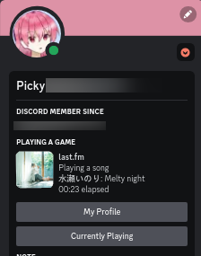

# Last Presence

Discord rich presence for last.fm

## Requirements

Python, pypresence, requests, bs4

`pip install -r requirements.txt`

## Usage
Edit `config.py` and put your profile link.  Example: `https://www.last.fm/user/username`

Then run main.py

`python main.py`

Note that the reported song to rich presence will lag a little behind the true currently playing song.
